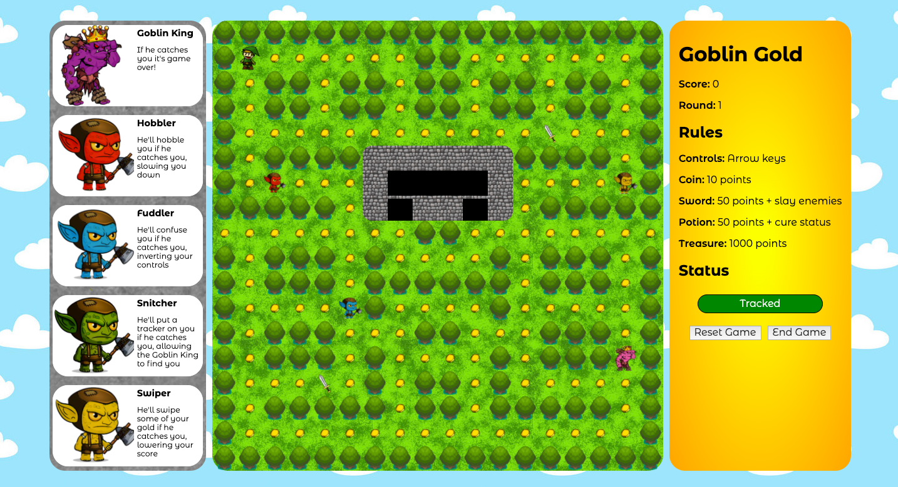
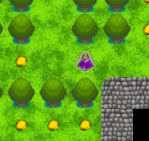
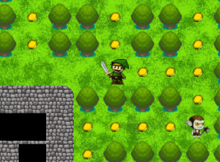
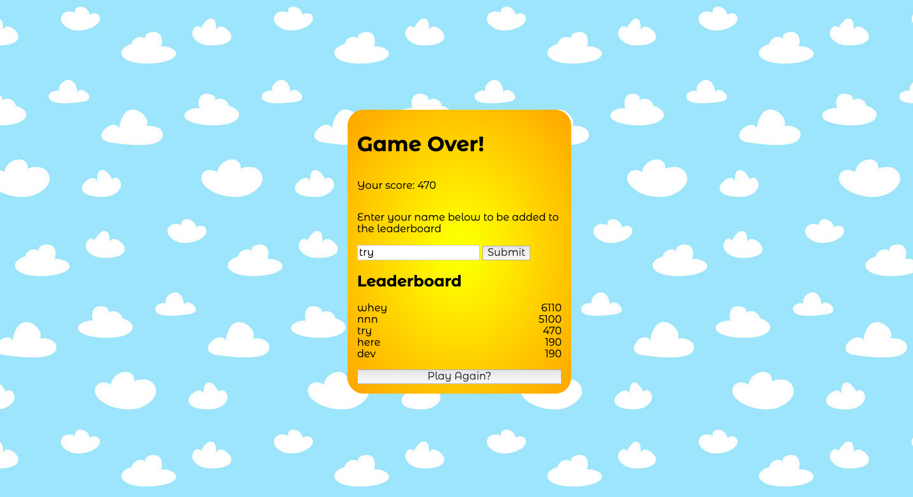

# Goblin Gold

<!--  -->

##  General Assembly: Software Engineering Immersive - Project 1

[Click here to run the application](https://nicolas-dolan.github.io/sei-project-1/)

## Overview

This was a PacMan-inspired grid-based game, which I built solo in 8 days. I used vanilla JavaScript to implement complex features such as pathfinding and decision trees in addition to spending time using CSS to create a visually appealing experience. Overall, I was very proud of my first project as it allowed me to translate something that had started in my imagination into a tangible experience that others could enjoy.



## Goal

To create a grid-based game using vanilla JavaScript.

### Timeframe
8 days

### Technologies used
JavaScript, HTML5, CSS3, Google Fonts, Git, GitHub.

## Instructions
The aim of the game is to collect as much gold as possible while avoiding the goblins. 

Use the arrow keys to control your player. Each coins is worth 10 points and occasionally treasure chests will appear, each worth 1000 points!

At any given time, one or more goblins may be pursuing you. Each goblin will incur its own unique penalty if it catches you: 
- The red goblin will hobble you, slowing you down. 
- The blue goblin will confuse you, inverting your controls. 
- The yellow goblin will cause you to lose points.
- The green goblin will cause the goblin king to start chasing you.
- The big goblin (the goblin king) will cause a game over.

Each of these penalties will be indicated by the status window on the right should they be incurred. 


However, potions may occassionally appear that can cure all status effects if collected.



There are also two swords located in the game which can be used to slay goblins for a limited time. The player will gain an increasing amount of points for each goblin slain before the time limit ends. Goblins will turn white and flee the player when he/she picks up a sword. The goblins will then turn grey to indicate the sword time limit is almost up, before turning back to their normal colour and no longer fleeing.



If you clear all the coins on the map you can advance to the next round. When you get a game over you can enter your score to see if you made it onto the leaderboard.



## Development

I created this grid-based game with vanilla JavaScript, HTML5, and CSS3. I divided the code into three sections:
- Query selectors
- Functions
- Event listeners

First I built the grid and the assets within it. Rather than manually specifying the placement of every wall (in this case tree), I created functions that would allow me to draw blocks of walls on the grid and automatically ring the perimeter with walls. This helps a lot of with scalability should I wish to create additional maps with different layouts in future.

```javascript
function drawHorizontalWalls(min, max) {
      let i = min
      for (i = min; i <= max; i++) {
        wallIndices.push(i)
      }
    }

    function drawBlock(min, max) {
      const n = Math.ceil((max + 1) / width) - Math.ceil((min + 1) / width) + 1
      let i = 0
      for (i = 0; i < n; i++) {
        drawHorizontalWalls(min + width * (i), max - width * (n - (i + 1)))
      }
    }

    function addWallEdges() {
      squares.forEach((element, index) => {
        if (squares[index] < (width * width - 1) && squares[index].classList.contains('wall') && !squares[index + 1].classList.contains('wall')) {
          squares[index].classList.add('rightEdge')
        }
      }) 
```


Then I created the functions to allow the user to move their player around the grid. Then I created the enemies and their movement patterns. *Note: the enemies are referred to as ghosts in the code because I originally developed the game as a PacMan clone before deciding to take it in a different direction.* The different enemies would cycle between chasing the player and simply roaming around the map. 

```javascript
function cycleMoveType() {
      ghostMoveAll()
      firstChase = setTimeout(function(){ 
        ghostChase1()
        // console.log('Pink is chasing') 
        firstReprieve = setTimeout(function(){ 
          ghostMoveAll()
          console.log('First reprieve') 
          secondChase = setTimeout(function(){ 
            ghostChase2()
            // console.log('Pink and Red are chasing')
            secondReprieve = setTimeout(function(){ 
              ghostMoveAll()
              console.log('Second reprieve') 
              finalChase = setTimeout(function(){ 
                ghostChase2()
                // console.log('Pink and Red are chasing again') 
              }, (15000 / round))
              cycleMoveArray.push(finalChase)
            }, 20000)  
            cycleMoveArray.push(secondReprieve)
          }, (15000 / round))
          cycleMoveArray.push(secondChase)
        }, 25000)
        cycleMoveArray.push(firstReprieve)
      }, (3000 / round))
      cycleMoveArray.push(firstChase)
    }
```

Then I created functions to control what would happen when each enemy type caught the player. I also added in a flee mechanic for when the player picked up the sword and a function for when the player caught a goblin. Finally I worked on the visuals and a leaderboard to record the player's score in localStorage.

```javascript
function generateLeaderBd() {
      const leaderboard = Object.entries(myStorage).map((element) => {
        return element = [element[0], parseInt(element[1])]
      }).sort((a,b) => b[1] - (a[1]))
      console.log('leaderboard', leaderboard)
      console.log('name', leaderboard[0][0], 'score', leaderboard[0][1])
      document.querySelector('.scores1 .name').innerHTML = leaderboard[0][0]
      document.querySelector('.scores1 .userScore').innerHTML = leaderboard[0][1]
      document.querySelector('.scores2 .name').innerHTML = leaderboard[1][0]
      document.querySelector('.scores2 .userScore').innerHTML = leaderboard[1][1]
      document.querySelector('.scores3 .name').innerHTML = leaderboard[2][0]
      document.querySelector('.scores3 .userScore').innerHTML = leaderboard[2][1]
      document.querySelector('.scores4 .name').innerHTML = leaderboard[3][0]
      document.querySelector('.scores4 .userScore').innerHTML = leaderboard[3][1]
      document.querySelector('.scores5 .name').innerHTML = leaderboard[4][0]
      document.querySelector('.scores5 .userScore').innerHTML = leaderboard[4][1]
    }
```

## Challenges

The enemies' pathfinding was by far the most complicated aspect of the game. I deliberately did not want to look up pathfinding solutions as I wanted to challenge myself. In the end I used an O(n<sup>2</sup>) algorthim: essentially using a map function within a map function. Every time the ghost would move it would simulate 40 possible random paths and choose the path with the least number of steps to the player. The algorithm did the job well, turning each enemy into a homing missile but was incrediblly inefficient and would have caused serious performance issues if their had been more enemies on screen at once.

## Wins

I think I created a fun, visually-appealing, creative game. I gave it my own twist and added in some novel features. It has no bugs that I have found and runs well. I'm very proud of it considering it was my first major project after only 3 weeks of learning to code.

## Future features and improvements

Principally the code needs to be refactored. I didn't use objects and often repeated myself, resulting in code that is very long and difficult to understand at a glance.

Additional features to include:
- Make the game run faster each round to make it increasingly difficult
- Hide the submit button on the leaderboard once pressed so that players cannot submit their score twice
- Add animations to smooth out movements on the grid
- Add animations for goblin or player deaths
- Add new themes to subsequent rounds such as snow or desert themes
- Add score bubbles when the player gains points
- Have treasure chests and potions disappear if not collected by the player in time
- Add sound effects
- Create a ghost sprite for goblins when slain that flees to their base and triggers their respawn

## Key learnings

I learnt a lot about how JavaScript functions work while making this game. However, my most important learnings were what not to do: principally, not to nest functions within other functions where possible as, more likely then not, that function could be used again somewhere else.